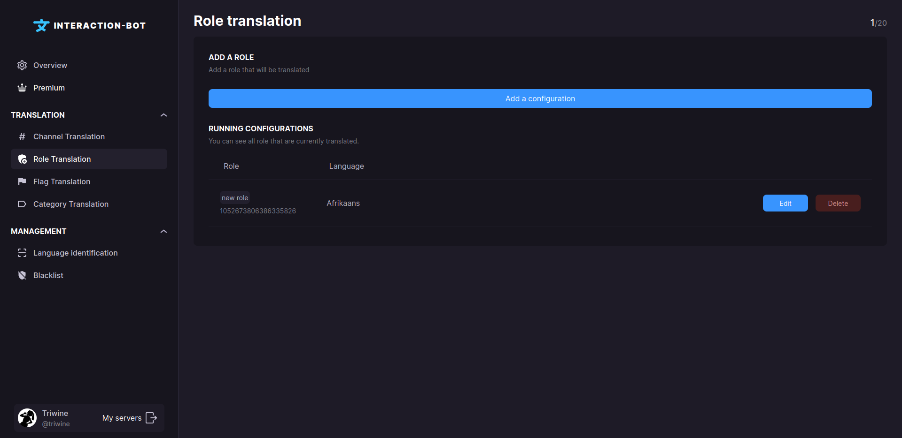

# Channel Translation

## Localization

This page is the first section on the navbar in the category _**translation**_ at the left of the page.

<figure><figcaption>
Channel translation page
</figcaption></figure>

## What channel translation does?

When this configuration is activated for a specific channel, each message that is not in the language defined by the configuration will be translated into the target language.&#x20;

## Translate a new channel

To translate a new channel, you need to click on _**Add a Configuration**_ button.

<figure><figcaption></figcaption></figure>

You see a popup that accepts different parameters

<figure><figcaption>
Channel translation popup
</figcaption></figure>

* _**CHANNEL**_: the channel where messages that are not in the target language will be caught.
* _**SENDING CHANNEL**_: the channel where the translation of the message will be sent.
* _**LANGUAGE**_: the language where the message will be translated, if the message is in a different language, it will be translated by this language and sent in the channel selected in the option _**Sending channel**_.

You can see more options by clicking on the _**OPTIONS**_.&#x20;

<figure><figcaption>
options dropdown
</figcaption></figure>

These options accept different parameters

* _**STYLE:**_ the style of the message, if the translation will be sent in embed, in a webhook, or just like a regular message
* _**DELETE MESSAGE:**_ if the language of the message sent by the user is different than the _**Language**_ option, the message will be deleted.
* _**DELETE TRANSLATION:**_ the bot will delete his translation after a time that depends on the length of the translation (0.13 seconds per character).
* _**TRANSLATE BOT:**_ even if the message is sent by a bot, the bot will translate the message if the language doesn't correspond to the target language.
* _**ALWAYS SEND:**_ even if the message is in the same language as the LANGUAGE option, the bot will translate the message.


These parameters can be left blank.


Once you have made your configuration, you must click on the _**Save**_ button on the popup. You will now see the new configuration that you have added, to post your configurations, follow[ this instruction](channel-translation.md#save-configurations).

## Save configurations

When you have configured all the channels that you want to be translated, don't forget to save your configuration!

<figure><figcaption></figcaption></figure>
